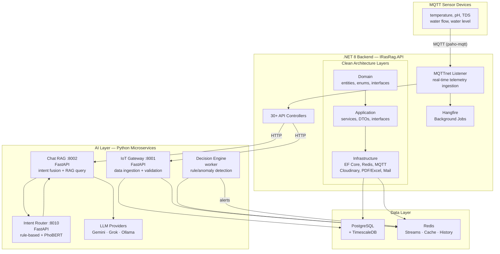

## Overview

iRAS-RAG is a comprehensive **intelligent aquaculture (fishery) management platform** that ingests real-time IoT sensor data from fish/shrimp farms, runs rule-based and AI anomaly detection, and provides an LLM-powered RAG advisory system for farmers.

The system is split across two major codebases: a **.NET 8 backend** (Clean Architecture) handling the core business logic, and a **Python AI layer** (4 FastAPI microservices) handling IoT ingestion, intent routing, RAG chat, and decision automation.

---

## Architecture

### System Diagram



### Clean Architecture (.NET Backend)

The backend follows **Clean Architecture** with strict layer separation:

- **Domain Layer** — Entities (`Farm`, `FishTank`, `SensorLog`, `Alert`, `FarmingBatch`), enums (`QueryType`, `AlertSeverity`), and core business rules. Zero external dependencies.
- **Application Layer** — Service interfaces (`IAdvisoryService`, `ITelemetryWindowService`), DTOs, repository interfaces (`IRepository<T>`, `IAlertRepository`), and AutoMapper profiles. Depends only on Domain.
- **Infrastructure Layer** — Concrete implementations: EF Core with PostgreSQL, `Ardalis.Specification` repository pattern, MQTTnet for IoT telemetry, Redis caching, Cloudinary for image hosting, MailKit, PdfPig for PDF parsing, ClosedXML for Excel exports, DocumentFormat.OpenXml for Word docs.
- **API Layer** — ASP.NET Core Web API with 30+ controllers, JWT Bearer authentication, Swagger/Swashbuckle, and Hangfire for background job scheduling.

**Key dependencies:** `Ardalis.Specification` for the repository pattern, `EFCore.NamingConventions` for snake_case PostgreSQL mapping, `BCrypt.Net-Next` for password hashing, `Testcontainers` for integration tests with real PostgreSQL in Docker.

---

## Backend Features

### IoT & Real-Time Telemetry

The system ingests real-time sensor data via **MQTT** (using the `MQTTnet` library). A Python simulator (`mqtt_sensor_simulator.py`) publishes readings for 5 sensor pins per device every 2 seconds: temperature, pH, TDS, water flow, and water level. The .NET backend's `TelemetryDispatchService` processes incoming MQTT messages, stores them via EF Core, and pushes live updates to connected clients.

```csharp
// TelemetryController — real-time sensor data window
[HttpGet("tanks/{tankId}/window")]
public async Task<IActionResult> GetWindow(Guid tankId)
```

The platform also supports a **simulation mode** where the backend can intercept MQTT readings for a specific device and replace them with synthetic dangerous values (e.g., 50-60°C temperature) to test alert responses.

### Multi-Tenant Farm Management

The system models the full aquaculture domain:

```
User → UserFarm → Farm → FishTank → FarmingBatch
                ↓
         SensorLogs, FeedingLogs, MortalityLogs, Alerts,
         ControlDevices, Cameras, Jobs, Recommendations
```

Each entity has its own controller with full CRUD, pagination, and authorization checks via `IUserTankAccessService`.

### Repository Pattern with Ardalis.Specification

The `IRepository<T>` interface provides both **expression-based** and **specification-based** query methods, supporting `ActiveOnly` / `All` / `DeletedOnly` query scoping:

```csharp
// Expression-based
Task<PagedResult<T>> GetPagedAsync(int pageNumber, int pageSize, QueryType type);

// Specification-based (Ardalis)
Task<IReadOnlyList<TResult>> ListAsync<TResult>(ISpecification<T, TResult> spec, QueryType type);
```

### AI Advisory Integration

The `.NET` backend bridges to the Python AI layer via `IAdvisoryService`. The `AdvisoryController` exposes:

- `POST /api/advisory/chat` — send a question, get an AI-powered response with intent classification, answer, citations
- `POST /api/advisory/chat/feedback` — rate AI responses as helpful/unhelpful for memory-assisted context
- `POST /api/advisory/diagnose-mortality` — AI-powered root cause analysis combining mortality logs, feeding data, and sensor alerts

### Background Jobs with Hangfire

Hangfire on PostgreSQL handles recurring tasks: daily report generation, alert aggregation windows, and periodic data cleanup. All jobs are defined in the API layer and processed by Hangfire workers within the same process.

---

## AI Layer — RAG Pipeline

The Python AI layer is composed of 4 independent FastAPI microservices orchestrated via Docker Compose:

### 1. IoT Gateway (`:8001`)
- Receives sensor telemetry via `POST /iot/ingest`
- Validates data against configurable **thresholds** (per species, per growth stage)
- Publishes to **Redis Streams** for downstream consumption
- Exposes stream stats and peek endpoints for debugging

### 2. Intent Router (`:8010`)
- Classifies incoming chat queries into 5 intents:
  - `farm_status` — real-time farm data queries
  - `knowledge` — SOP/document-based questions
  - `mixed` — combines farm data + knowledge
  - `off_topic` — blocked (no LLM call)
  - `clarify` — ambiguous, asks follow-up
- **Rule-based backend** (fast, deterministic) with optional **PhoBERT** (Vietnamese BERT) for semantic classification
- Supports **sentence decomposition** for multi-clause queries (multi-intent detection)
- Returns intent scores, entities, and routing metadata

### 3. Chat RAG API (`:8002`)
- Core AI endpoint: `POST /chat`
- **Intent fusion** — routes to the right data source based on intent:
  - `farm_status` → queries Redis Streams for real-time sensor data
  - `knowledge` → RAG retrieval with cosine similarity on pre-computed chunk embeddings
  - `mixed` → combines both sources, fuses results in the LLM prompt
  - `off_topic` → refuses with a domain-scoped message (agriculture only)
  - `clarify` → asks follow-up questions for disambiguation
- **Chat history** stored per-user in Redis, with history scoped by intent for context-aware prompts
- **Memory assistant** — remembers helpful responses (`helpful=true` feedback) for context reuse
- **LLM providers** — Gemini, Grok (xAI), and Ollama (local) with provider fallback
- **Web search fallback** — when RAG returns low-confidence results, optionally searches Google (via CSE or SerpAPI) and cites web sources
- **RAG upload** — `POST /rag/upload` for document ingestion

### 4. Decision Engine (Worker)
- Consumes from the main Redis Stream (`STREAM_KEY`)
- Runs rule-based anomaly detection against sensor thresholds
- Emits alerts to `ALERTS_STREAM`
- Notifier subscriber pushes alerts to Telegram via bot API
- Configurable alert aggregation windows and mute periods

---

## Key Technical Decisions

| Decision | Rationale |
|---|---|
| **Clean Architecture** | Strict layer separation enables independent testing of domain logic, easy swapping of infrastructure (e.g., switch from PostgreSQL to another DB) |
| **Ardalis.Specification** | Type-safe, composable query specifications — avoids repository explosion (one repo per query method) |
| **PostgreSQL + TimescaleDB** | TimescaleDB hypertables for time-series sensor data — automatic partitioning, fast range queries |
| **Redis Streams** | Decouples IoT ingestion from processing; enables multiple consumer groups (decision engine, notifier) reading the same stream independently |
| **MQTT for IoT** | Lightweight pub/sub protocol ideal for constrained sensor devices; MQTTnet provides native .NET integration |
| **Hybrid Intent Routing** | Rule-based (fast, 0ms cold start) + PhoBERT (semantic understanding for Vietnamese) + LLM fallback — layered defense for reliability |
| **Hangfire on PostgreSQL** | No separate queue infrastructure needed; background jobs co-located with the API, transaction-safe enqueue |
| **EFCore.NamingConventions** | Automatic snake_case mapping for PostgreSQL without manual column attribute decoration |
| **Testcontainers** | Integration tests run against real PostgreSQL in Docker — identical to production, zero mocking at the DB layer |

---

## Running the System

```bash
# AI Layer
docker compose up -d --build

# .NET Backend
dotnet run --project IRasRag.API

# MQTT Simulator (generates test sensor data)
python mqtt_sensor_simulator.py
```

The API is available at `http://localhost:5027/api` with Swagger UI at `/swagger`. The AI layer services run on ports 8001 (IoT Gateway), 8002 (Chat RAG), and 8010 (Intent Router).
