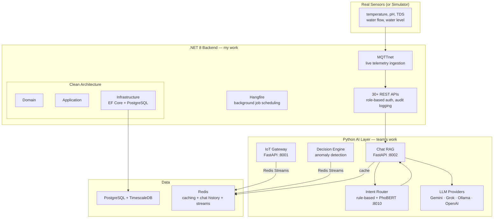

## What is this?

This was my **graduation thesis** (January–June 2026). Shrimp and fish farmers in Vietnam make most decisions from experience and paper SOPs. When a pond's pH spikes or fish start dying off, they call an expert. At 2 AM, there's nobody to call.

So we built a system that reads real-time sensor data (temperature, pH, dissolved solids, water flow) over MQTT, cross-references it with uploaded SOP documents through a RAG pipeline, and answers questions like _"Is my pH too high for this growth stage?"_ or _"What should I do about the mortality spike in tank 3?"_

I led a team of 4. I built roughly 40% of the .NET backend APIs, designed the project structure and Clean Architecture scaffold, set up the MQTT broker and cloud deployment pipeline, and wrote the MQTT sensor simulator. The AI layer (RAG engine, intent classifier, LLM integration) was a team effort that I architected and coordinated.

---

## How it works



The system has two halves: a **.NET 8 backend** managing farms, users, sensors, and business logic, and a **Python AI layer** that figures out what the farmer is asking, finds relevant documents, and generates an answer.

---

## What I built (backend)

### Project structure & Clean Architecture

I designed the entire backend project scaffold: the solution layout, the four-layer Clean Architecture separation (Domain → Application → Infrastructure → API), dependency injection wiring, and the shared library of base classes and utilities that the rest of the team built on top of. I also set up the CI/CD pipeline on GitHub Actions and managed cloud deployments to a Linux VPS behind an NGINX reverse proxy.

### The API surface

I personally wrote about 40% of the 30+ controllers: user management with JWT + role-based access control, admin audit logging that tracks every mutation, and REST endpoints for farms, fish tanks, sensor types, and SOP management. Everything runs through the Clean Architecture stack I scaffolded, so the core logic is completely decoupled from the database or framework.

I used `Ardalis.Specification` instead of raw repository methods. It lets you compose queries like `ActiveFarms.WithTanks().OwnedBy(userId)` without writing a separate method for every permutation. Paired with `EFCore.NamingConventions`, the PostgreSQL tables use `snake_case` automatically without manual column mapping.

```csharp
// Repository pattern: expression-based + specification-based queries
Task<PagedResult<T>> GetPagedAsync(int pageNumber, int pageSize, QueryType type);
Task<IReadOnlyList<TResult>> ListAsync<TResult>(ISpecification<T, TResult> spec, QueryType type);
```

Every entity has soft-delete through a `QueryType` enum (`ActiveOnly`, `All`, `DeletedOnly`) that flows through the entire query pipeline so there's no risk of accidental data loss or scattered `WHERE deleted_at IS NULL` clauses.

### Real-time telemetry

Sensor data arrives over **MQTT**. I set up the MQTT broker, configured the topic structure (`iras-rag/telemetry/{mac}`), and wrote the `MQTTnet` listener in the .NET backend that subscribes and dispatches incoming readings into PostgreSQL (TimescaleDB hypertables for the time-series heavy lifting) and Redis Streams for the AI layer to consume. I also wrote a Python MQTT simulator (`mqtt_sensor_simulator.py`) that publishes readings every 2 seconds across 5 pins so we could develop without physical hardware.

We also built a **simulation mode** where the backend intercepts real MQTT data for a specific device and replaces it with synthetic dangerous values (50–60°C). This lets farmers safely test scenarios like "what would the system tell me if my water was overheating?"

### Bridging to the AI

The `AdvisoryController` is the bridge between the .NET world and the Python AI. Three endpoints I built:

- `POST /api/advisory/chat` — forwards the farmer's question to the Python chat-rag service and returns the AI's answer with intent classification, citations, and confidence
- `POST /api/advisory/chat/feedback` — records thumbs up/down on AI responses; helpful ones get saved as context memory for future queries
- `POST /api/advisory/diagnose-mortality` — pulls mortality logs, recent feeding data, and sensor alerts into a prompt and asks the AI to diagnose the root cause

### Background jobs

Hangfire on PostgreSQL handles recurring work like daily report generation, alert aggregation, and data cleanup. Since Hangfire stores jobs in PostgreSQL, we didn't need a separate queue infrastructure.

---

## What my team built (AI layer)

The Python side is 4 FastAPI services in Docker Compose. I architected the service boundaries and data flow, then the team built out each service.

### RAG Engine

Farmers upload PDF SOPs through the API. The pipeline my team built:

1. **Ingest** — `POST /rag/upload` accepts a PDF, extracts text with `PyPDF2`
2. **Chunk** — splits into overlapping segments, generates embeddings (via the configured LLM provider's embedding API)
3. **Store** — writes chunks + embedding vectors to PostgreSQL (schema is `pgvector`-ready, though at thesis scale I used local cosine similarity)
4. **Retrieve** — on query, embeds the question, computes cosine similarity against stored chunks, returns the top-N ranked by relevance score (configurable `RAG_MIN_SCORE` threshold)

The LLM layer is intentionally lightweight. It's an `httpx` client that posts to `/v1/chat/completions` and works with Gemini, Grok (xAI), Ollama (local), and OpenAI by swapping the `LLM_PROVIDER` environment variable. We skipped LangChain and similar orchestration frameworks in favor of ~50 lines we could fully debug and understand.

### Hybrid Intent Classification

Before a question hits the LLM, the system needs to know what *kind* of question it is. My team built a two-tier classifier that I designed the architecture for:

**Tier 1 — Rule-based:** Regex and keyword matching catches straightforward patterns. _"Bể t1 hôm nay pH bao nhiêu?"_ maps to `farm_status`. _"SOP xử lý pH cao?"_ maps to `knowledge`. Runs in under 1ms with no API cost.

**Tier 2 — PhoBERT (semantic path):** For ambiguous or multi-clause queries, the team fine-tuned `vinai/phobert-base` (Vietnamese BERT) to classify into 5 intents: `farm_status`, `knowledge`, `mixed`, `off_topic`, `clarify`. When PhoBERT confidence is low, it falls back to the rule engine.

The classified intent determines what happens next: `farm_status` pulls live sensor data from Redis Streams, `knowledge` searches the document store, `mixed` does both and fuses the context in the LLM prompt, and `off_topic` gets blocked before reaching the LLM.

### Web Search Fallback

When a farmer asks about something not covered by the uploaded SOPs, the system can optionally fall back to web search. My team integrated Google Custom Search and SerpAPI for this. Responses get tagged `answer_basis=web_search` with source URLs as citations.

---

## Key decisions I'd defend

| Decision | Why |
|---|---|
| **Clean Architecture** | At thesis scale it seemed like overkill, but it meant I could swap from in-memory caching to Redis, or from raw SQL to EF Core, without touching a line of domain logic |
| **Ardalis.Specification over raw repositories** | One `IRepository<T>` instead of 30 `I*Repository` interfaces. Type-safe query composition without the explosion |
| **TimescaleDB hypertables** | Sensor data grows fast (1 reading/sec × 5 pins × N devices). Timescale auto-partitions by time, so queries stay fast without manual sharding |
| **Redis Streams over RabbitMQ** | We already had Redis for caching and chat history. Using it as a message queue too meant one less service to manage in Docker Compose |
| **No LangChain** | For a thesis project, the abstractions added more complexity than they removed. An `httpx` client posting to an OpenAI-compatible endpoint is about 50 lines we could fully debug |
| **Hybrid intent routing (rules + PhoBERT)** | Pure ML is slow and expensive for simple queries. Rules catch 80% of cases in <1ms. The model handles the ambiguous 20% |

---

## Running it

```bash
# AI layer (Python services + PostgreSQL + Redis)
docker compose up -d --build

# .NET backend
dotnet run --project IRasRag.API

# Simulate sensor data for development
python mqtt_sensor_simulator.py
```

The .NET API is at `localhost:5027/api` with Swagger at `/swagger`. The Python services run on ports 8001 (IoT Gateway), 8002 (Chat RAG), and 8010 (Intent Router).
